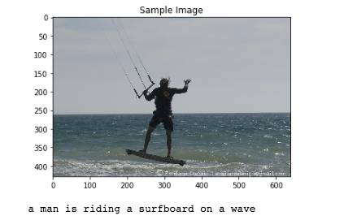
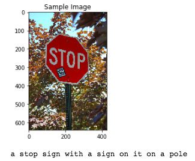
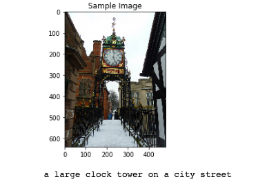

# Automatic Image Captioning

## Introduction 
Image Captioning is the process of generating textual description of an image. It uses both Natural Language Processing and Computer Vision to generate the captions.

 

 

 

## Network Topology

**Encoder**
We use Convolutional Neural Network(CNN) as our encoder. The image is given to CNN to extract the relavant features. The last hidden state in CNN is connected to Decoder
The encoder that we provide to you uses the pre-trained ResNet-50 architecture (with the final fully-connected layer removed) to extract features from a batch of pre-processed images. The output is then flattened to a vector, before being passed through a Linear layer to transform the feature vector to have the same size as the word embedding.

**Decoder**
We use Recurrent Neural Network(RNN) as our encoder which it takes the features from encoder and procuce a sectence for it. 

## Dataset
The Microsoft **C**ommon **O**bjects in **CO**ntext (MS COCO) dataset is a large-scale dataset for scene understanding.  The dataset is commonly used to train and benchmark object detection, segmentation, and captioning algorithms.  

You can read more about the dataset on the [website](http://cocodataset.org/#home) or in the [research paper](https://arxiv.org/pdf/1405.0312.pdf).
